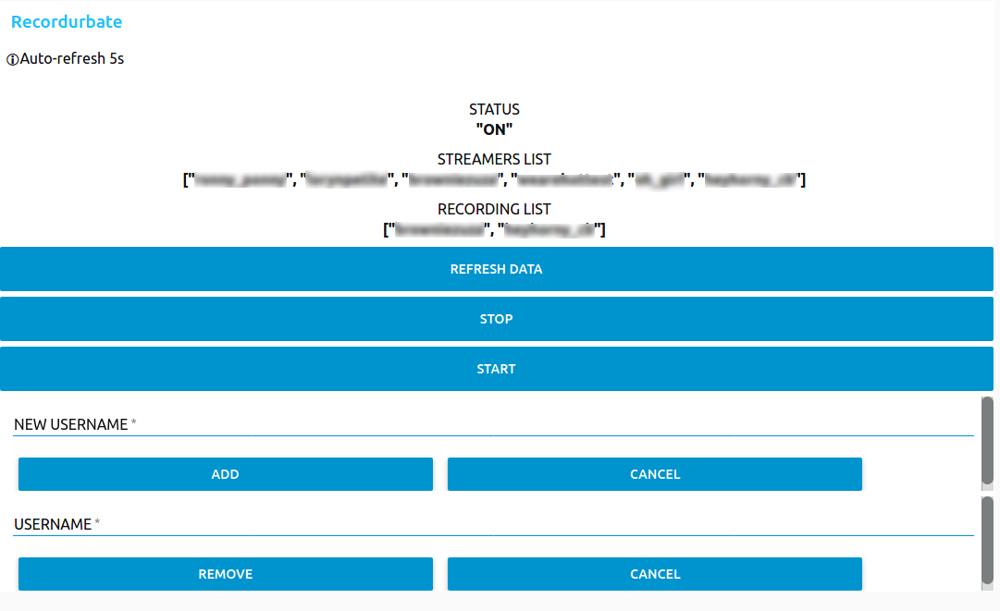

# Recordurbate-server

Server for Recordurbate with Dockerfile 😃

Use https://github.com/oliverjrose99/Recordurbate project, so build your docker image to get a new oliverjrose99's Recordurbate version 😃

## API

With docker-compose, run the service and call http://localhost:5599

- GET /streamers : to get the list of watching streamers
- PUT /streamers/{name} : to add a streamer
- DELETE /streamers/{name}
- GET /recording : to get the list of recording streamers
- GET /status : to get the bot status ON or OFF
- PUT /status : change the bot status to ON or OFF - Interesting to put on pause for example to have bandwidth to watch a movie 😁

## Docker-compose example

```yml
version: '3.5'
services:
  app:
    restart: unless-stopped
    image: gallofeliz/recordurbate-server
    volumes:
      - ./downloads:/app/videos
      - ./configs:/app/configs
    ports:
      - 5599:5599
    #you can define user but you need to create mount volumes before with correct rights
    #user: '1000:1000'
    environment:
      TZ: Europe/Paris
      CONFIG_YOUTUBEDL_CMDARGS: -o "videos/%(id)s/%(title)s.%(ext)s" --no-part --hls-use-mpegts -v
```

For ARM (Raspberry Pi), you can build your own :

```yml
services:
  app:
    build:
      context: https://github.com/gallofeliz/recordurbate-server.git
      dockerfile: Dockerfile
```

## UI

You can design your own UI for that, or use curl, postman. I use node-red dashboard 😃


